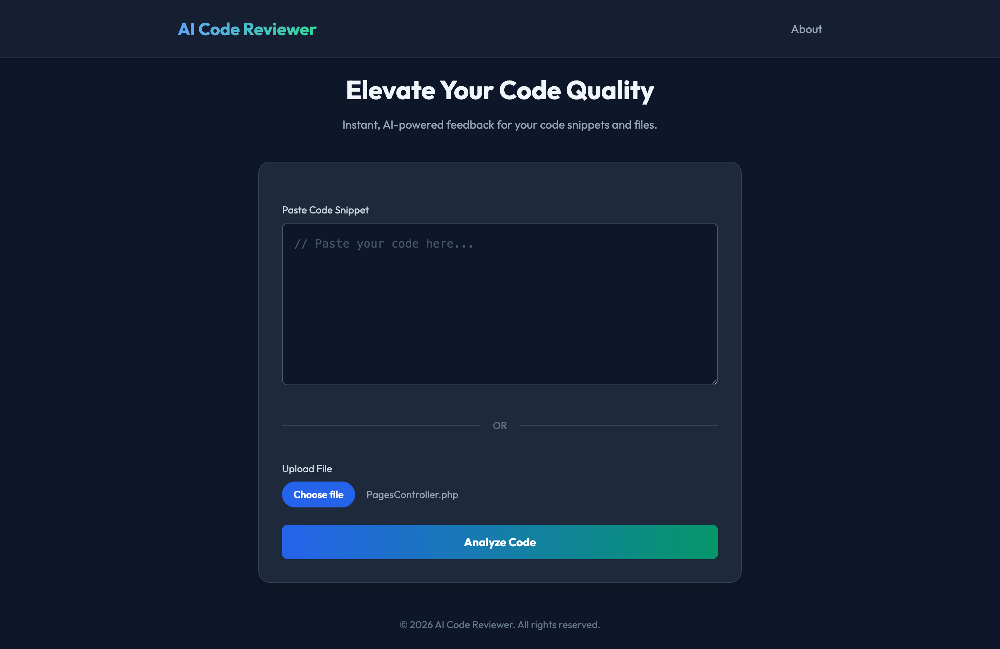

# AI Code Reviewer

An intelligent code review assistant built with Laravel and OpenAI. 

This application allows developers to submit code snippets or upload files to receive instant, AI-generated feedback on best practices, security, performance, and potential bugs.

## Features

- **AI-Powered Analysis**: Uses OpenAI (GPT-4o) to provide detailed code reviews.
- **Zero Database Dependency**: The project is configured to run entirely without a database connection (sessions, cache, and queues use file/sync drivers).
- **Clean UI**: Modern, responsive interface built with Tailwind CSS.
- **Dual Input**: Support for direct copy-paste or file uploads.
- **Markdown Rendering**: Review results are formatted beautifully with Markdown.

## Screenshots




## Requirements

- PHP 8.2 or higher
- Composer

## Installation

1. **Clone the repository**
   ```bash
   git clone https://github.com/shazimali/ai-code-reviewer.git
   cd ai-code-reviewer
   ```

2. **Install Dependencies**
   ```bash
   composer install
   ```

3. **Environment Setup**
   Copy the example environment file:
   ```bash
   cp .env.example .env
   ```

4. **Configure OpenAI API**
   Open the `.env` file and add your OpenAI API Key:
   ```env
   OPENAI_API_KEY=sk-your-api-key-here
   OPENAI_MODEL=gpt-4o
   ```
   
   *Note: The project is pre-configured to ignore database connections, so you do not need to set up MySQL or SQLite.*

5. **Generate App Key**
   ```bash
   php artisan key:generate
   ```

6. **Run the Application**
   ```bash
   php artisan serve
   ```
   Visit `http://localhost:8000` in your browser.

## Architecture

This project follows a service-oriented architecture to keep the logic decoupled and testable.

- **Controller**: `CodeReviewController` handles the HTTP layer.
- **Service Layer**: 
    - `AiReviewService` (Interface): Defines the contract for review services.
    - `OpenAiReviewService`: Production implementation using OpenAI API.
    - `MockAiReviewService`: Fallback implementation for testing without API costs.
- **Frontend**: Blade templates with inline Tailwind CSS for styling and `marked.js` for rendering Markdown responses.

## License

This project is open-sourced software licensed under the [MIT license](https://opensource.org/licenses/MIT).
